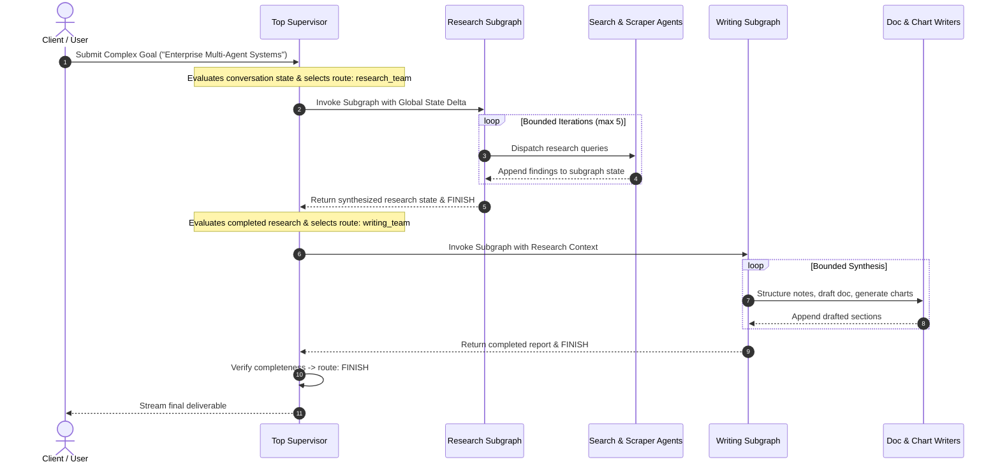
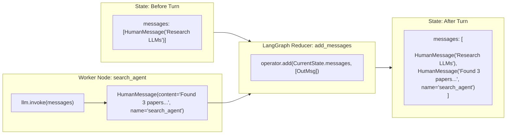

# LangGraph Agent Workflows: Stateful Multi-Agent Systems & Hierarchical Supervisor Graphs

[](https://www.python.org/downloads/)
[](https://github.com/langchain-ai/langgraph)
[](https://ai.google.dev/)
[](https://opensource.org/licenses/MIT)

> **Engineering Design Document & Production Reference Implementation**  
> *Author:* **Ishan Dhiman** ([@BigBro2454](https://github.com/BigBro2454))  
> *Target Architecture:* Google Cloud AI / Vertex AI Multi-Agent Workflows / LangGraph Stateful Systems

---

## 1. Executive Summary & Systems Problem Statement

Modern enterprise generative AI architectures are transitioning from stateless, single-turn prompting to **stateful, long-horizon multi-agent systems**. However, scaling agentic systems introduces critical systems failure modes:

1. **The Linear DAG Fallacy**: Traditional workflow orchestrators assume directed acyclic graphs (DAGs). Real-world cognitive workflows (reflection, refinement, human-in-the-loop validation) are intrinsically **cyclic state machines** requiring controlled loops and convergence checks.
2. **Context Degradation & Token Sprawl**: Monolithic agents that ingest every intermediate reasoning step into a single context window quickly exceed latency budgets, induce context poisoning, and trigger exponential token costs.
3. **Black-Box Routing & Ambiguous Handoffs**: Free-form natural language handoffs between agents suffer from hallucinated transitions, infinite ping-pong loops, and untraceable routing failures.

### The Solution: Hierarchical Graph-of-Graphs Architecture
`langgraph-agent-workflows` provides a production-grade blueprint for stateful multi-agent systems built with **LangGraph** and powered by **Google Gemini 2.5 Flash**. It demonstrates:
* **Cyclic StateGraph State Machines**: Cyclic message graph execution with append-only state delta reducers (`add_messages`).
* **Hierarchical Graph Decomposition**: Treating entire compiled subgraphs as first-class nodes within a parent supervisor graph (Graph-of-Graphs pattern).
* **Deterministic Structured Routing**: Enforcing agent handoffs via Pydantic type-safe routing schemas (`with_structured_output`) eliminating regex/string parsing failures.
* **Bounded Bounded Recursion & Failure Containment**: Strict recursion ceilings, sandboxed subgraphs, and graceful execution fallback.

---

## 2. High-Level Systems Architecture

The system operates across three hierarchical tiers: the **Top-Level Supervisor Gateway**, the **Domain Subgraph Clusters** (Research and Writing), and the **Specialist Agent Nodes**.


---

## 3. Deep Architectural Blueprints

### Blueprint 1: Hierarchical State Delegation & Subgraph Encapsulation
Rather than flattening all 6 agents into a single unmanageable swarm, the top supervisor delegates tasks to domain-isolated subgraphs. Each subgraph encapsulates its internal state iterations and only emits summarized state deltas back to the parent graph.



### Blueprint 2: State Reducer Mechanics (`add_messages`)
LangGraph state schemas avoid destructive state overwrites by leveraging annotated delta reducers. When any worker agent yields a message, LangGraph merges it into the global timeline using an append-only reducer.



### Blueprint 3: Deterministic Routing with Structured Output
Agent handoffs are protected against model hallucinations through Pydantic schema validation. The supervisor is bound to a strict typed union:

```python
class SuperRoute(BaseModel):
    next: Literal["research_team", "writing_team", "FINISH"]

super_supervisor = super_prompt | llm.with_structured_output(SuperRoute)
```

If the LLM outputs an unauthorized agent target, Pydantic immediately catches the schema violation before edge traversal, preventing corrupt graph transitions.

---

## 4. Implementation Catalog

The repository provides two core architectures showcasing the progression from foundational state machines to enterprise hierarchical swarms:

| Module | Architecture | Primary Components | Systems Purpose |
| :--- | :--- | :--- | :--- |
| **[`main.py`](./main.py)** | Single-Node Cyclic StateGraph | `StateGraph`, `add_messages`, Google Gemini 2.5 Flash | Demonstrates foundational cyclic state tracking, streaming events, and memory preservation across conversation turns. |
| **[`hierarchical_blog_writer.py`](./hierarchical_blog_writer.py)** | Hierarchical Multi-Agent Graph-of-Graphs | 3 Supervisors, 5 Specialist Agents, 2 Nested Subgraphs | Production implementation of hierarchical supervisor pattern with structured Pydantic routing and recursion bounding. |
| **[`run_agent.py`](./run_agent.py)** | Unified CLI Runner & Test Orchestrator | `argparse`, `unittest` runner, mode dispatch | Operational CLI providing interactive execution, prompt overrides, and automated test suite validation. |
| **[`tests/test_graphs.py`](./tests/test_graphs.py)** | Graph Topology & Schema Validation Suite | `unittest`, topological inspection, Pydantic checks | Automated test suite verifying graph compilation, edge connectivity, and routing schema contracts. |

---

## 5. Google L5 Systems & Architectural Trade-off Matrix

| Architectural Vector | Naive / Linear Approach | LangGraph Hierarchical Graph-of-Graphs | L5 Engineering Rationale & Trade-offs |
| :--- | :--- | :--- | :--- |
| **Workflow Topology** | Flat Linear Chain (`A -> B -> C`) | Hierarchical Cyclic State Machine (`StateGraph`) | Real-world problem solving requires reflection loops and fallback paths. Linear chains fail irreversibly upon intermediate step errors. |
| **Agent Decomposition** | Single Monolithic Generalist Agent | Domain Subgraphs with Specialist Worker Nodes | Monolithic prompts suffer from cognitive overload and tool confusion. Isolated subgraphs reduce context poisoning and localize prompt tuning. |
| **Routing Protocol** | Unstructured JSON string parsing via regex | Type-safe Pydantic Schema (`with_structured_output`) | Zero parsing exceptions. Schema constraints guarantee that routing targets are valid compiled nodes in the graph. |
| **State Management** | Global string concatenation / dictionary overwrite | Annotated Delta Reducers (`Annotated[list, add_messages]`) | Preserves immutable audit history of agent-to-agent exchanges and prevents race conditions during multi-node merges. |
| **Context Window Cost** | Accumulate entire conversation indefinitely | Subgraphs return summarized state deltas to parent | Prevents quadratic token cost escalation on long tasks. Top supervisor only maintains high-level milestones. |
| **Failure Containment** | Unbounded while-loop risking infinite spend | Hard recursion ceiling (`recursion_limit=20`) | Protects against infinite cycling between ping-ponging supervisors; fails safely with deterministic termination. |

---

## 6. Production Guardrails & Resiliency

### 1. Bounded Recursion Limits
In cyclic graphs, two agents could potentially debate indefinitely. LangGraph enforces a hard execution ceiling via the execution config:
```python
events = super_graph.stream(
    {"messages": [HumanMessage(content=user_input)]},
    {"recursion_limit": 20}
)
```
If the graph exceeds 20 node traversals without reaching `FINISH`, LangGraph raises a `GraphRecursionError`, shielding downstream APIs from runaway compute costs.

### 2. Zero-Leak Credential Hygiene
All API interactions authenticate via environment variables (`GEMINI_API_KEY`). The project enforces zero tracking of secrets through automated pre-push audits and `.gitignore` containment.

### 3. Graceful Model Fallback
The LLM client is parameterized via `GEMINI_MODEL` (defaulting to `gemini-2.5-flash`), allowing zero-code re-routing to `gemini-1.5-pro` or regional Vertex AI endpoints during rate limits or failover scenarios.

---

## 7. Quantitative Evaluation & Verification

To evaluate graph reliability, the repository includes an automated test harness validating graph topologies, node bindings, and Pydantic schemas:

```bash
# Execute unit tests
python run_agent.py --test
```

### Test Suite Coverage:
* `test_simple_graph_compilation_and_topology`: Verifies `main.graph` compilation and start/node/end boundaries.
* `test_research_subgraph_topology`: Verifies supervisor and worker node registration (`search_agent`, `web_scraper_agent`).
* `test_writing_subgraph_topology`: Verifies supervisor and worker node registration (`doc_writer_agent`, `note_taker_agent`, `chart_generator_agent`).
* `test_super_graph_hierarchy`: Verifies compiled subgraphs are registered as valid executable nodes in the parent graph.
* `test_pydantic_routing_schemas`: Asserts strict type validation across `ResearchRoute`, `WritingRoute`, and `SuperRoute`.

---

## 8. Getting Started & Quickstart

### Prerequisites
* Python 3.10 or higher
* Google Gemini API Key ([Google AI Studio](https://aistudio.google.com/))

### Installation
```bash
# 1. Clone repository
git clone https://github.com/BigBro2454/langgraph-agent-workflows.git
cd langgraph-agent-workflows

# 2. Create and activate virtual environment
python3 -m venv .venv
source .venv/bin/activate

# 3. Install dependencies
pip install -r requirements.txt

# 4. Configure environment variables
cp .env.example .env
# Edit .env with your GEMINI_API_KEY
```

### Execution Modes

#### Mode 1: Run Automated Verification Tests
```bash
python run_agent.py --test
```

#### Mode 2: Interactive Foundational Chatbot
```bash
python run_agent.py --mode simple
```

#### Mode 3: Hierarchical Multi-Agent Supervisor
```bash
python run_agent.py --mode hierarchical --prompt "Analyze the systems trade-offs of streaming SSE versus WebSockets in multi-agent generative UI."
```

---

## 9. Repository Roadmap & L5 Enhancements

- [x] Cyclic state machine with `add_messages` reducer.
- [x] Hierarchical multi-agent supervisor pattern (subgraphs as nodes).
- [x] Structured output routing with Pydantic type safety.
- [x] Automated unit test suite for graph topology and schemas.
- [ ] **LangGraph Checkpointing**: Add `SqliteSaver` / `PostgresSaver` for persistent state pause-and-resume.
- [ ] **Human-in-the-Loop (HITL)**: Introduce breakpoint interrupts (`interrupt_before=["doc_writer_agent"]`) for human editorial sign-off.
- [ ] **LangSmith Observability**: OpenTelemetry tracing for multi-node latency and token attribution.

---

## License

This project is licensed under the MIT License — see the [LICENSE](./LICENSE) file for details.
