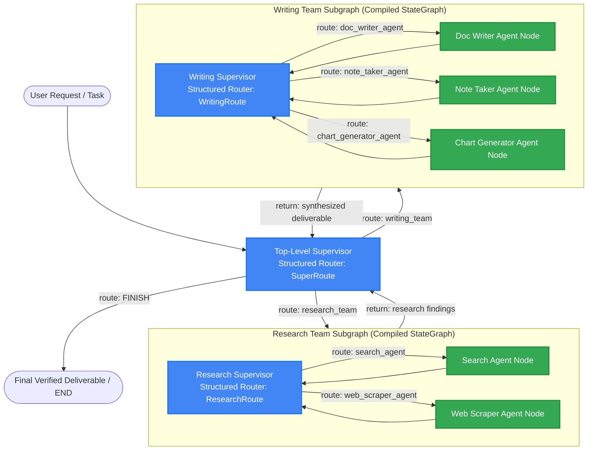
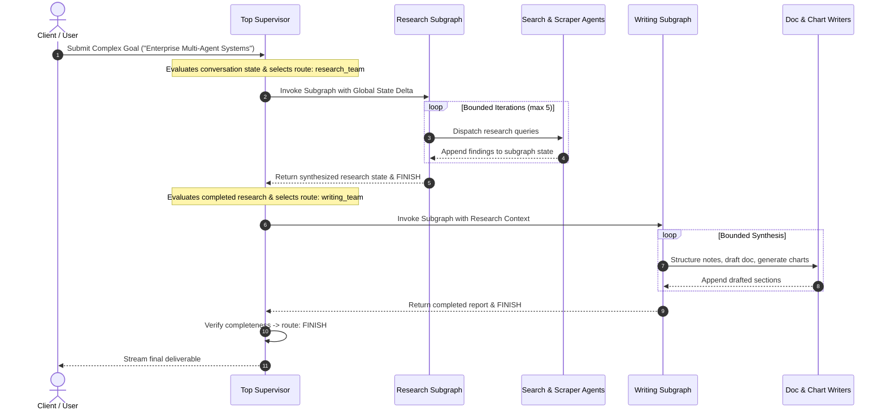
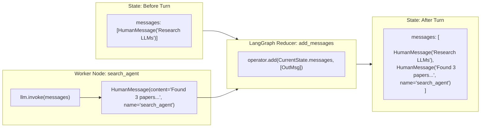
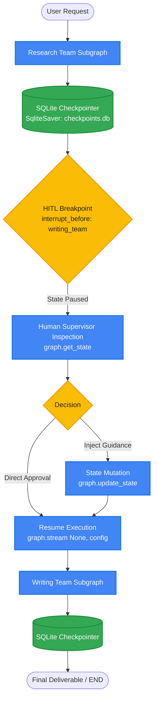
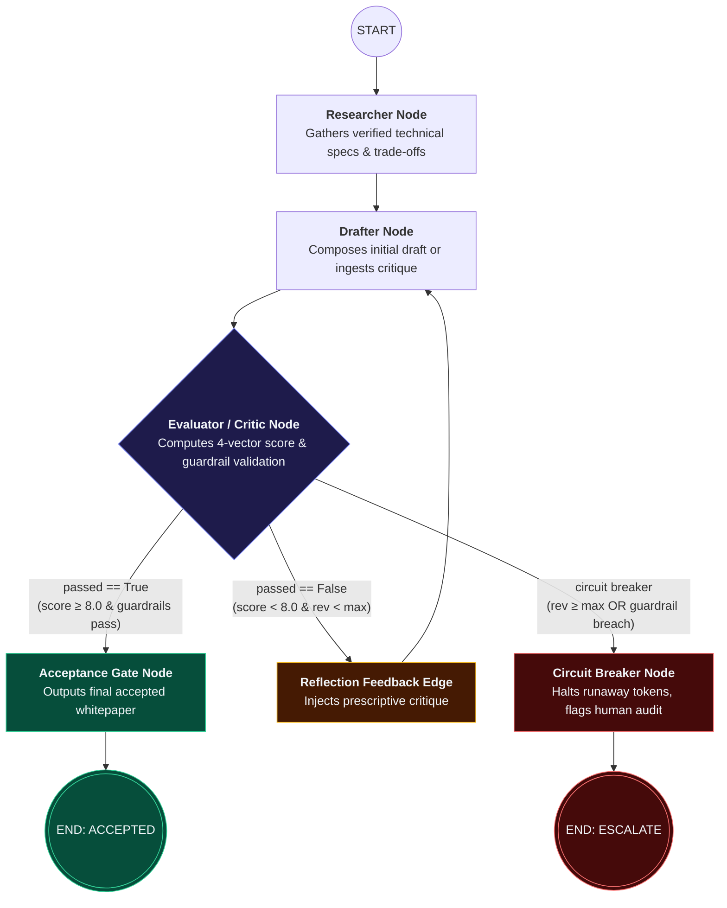

# LangGraph Agent Workflows: Stateful Multi-Agent Systems & Hierarchical Supervisor Graphs

[](https://www.python.org/downloads/)
[](https://github.com/langchain-ai/langgraph)
[](https://ai.google.dev/)
[](https://opensource.org/licenses/MIT)

> **Engineering Design Document & Production Reference Implementation**  
> *Author:* **Ishan Dhiman** ([@BigBro2454](https://github.com/BigBro2454))  
> *Target Architecture:* Google Cloud AI / Vertex AI Multi-Agent Workflows / LangGraph Stateful Systems

---

## 1. Executive Summary & Systems Problem Statement

Modern enterprise generative AI architectures are transitioning from stateless, single-turn prompting to **stateful, long-horizon multi-agent systems**. However, scaling agentic systems introduces critical systems failure modes:

1. **The Linear DAG Fallacy**: Traditional workflow orchestrators assume directed acyclic graphs (DAGs). Real-world cognitive workflows (reflection, refinement, human-in-the-loop validation) are intrinsically **cyclic state machines** requiring controlled loops and convergence checks.
2. **Context Degradation & Token Sprawl**: Monolithic agents that ingest every intermediate reasoning step into a single context window quickly exceed latency budgets, induce context poisoning, and trigger exponential token costs.
3. **Black-Box Routing & Ambiguous Handoffs**: Free-form natural language handoffs between agents suffer from hallucinated transitions, infinite ping-pong loops, and untraceable routing failures.

### The Solution: Hierarchical Graph-of-Graphs Architecture
`langgraph-agent-workflows` provides a production-grade blueprint for stateful multi-agent systems built with **LangGraph** and powered by **Google Gemini 2.5 Flash**. It demonstrates:
* **Cyclic StateGraph State Machines**: Cyclic message graph execution with append-only state delta reducers (`add_messages`).
* **Hierarchical Graph Decomposition**: Treating entire compiled subgraphs as first-class nodes within a parent supervisor graph (Graph-of-Graphs pattern).
* **Deterministic Structured Routing**: Enforcing agent handoffs via Pydantic type-safe routing schemas (`with_structured_output`) eliminating regex/string parsing failures.
* **Bounded Bounded Recursion & Failure Containment**: Strict recursion ceilings, sandboxed subgraphs, and graceful execution fallback.

---

## 2. High-Level Systems Architecture

The system operates across three hierarchical tiers: the **Top-Level Supervisor Gateway**, the **Domain Subgraph Clusters** (Research and Writing), and the **Specialist Agent Nodes**.



---

## 3. Deep Architectural Blueprints

### Blueprint 1: Hierarchical State Delegation & Subgraph Encapsulation
Rather than flattening all 6 agents into a single unmanageable swarm, the top supervisor delegates tasks to domain-isolated subgraphs. Each subgraph encapsulates its internal state iterations and only emits summarized state deltas back to the parent graph.



### Blueprint 2: State Reducer Mechanics (`add_messages`)
LangGraph state schemas avoid destructive state overwrites by leveraging annotated delta reducers. When any worker agent yields a message, LangGraph merges it into the global timeline using an append-only reducer.



### Blueprint 3: Deterministic Routing with Structured Output
Agent handoffs are protected against model hallucinations through Pydantic schema validation. The supervisor is bound to a strict typed union:

```python
class SuperRoute(BaseModel):
    next: Literal["research_team", "writing_team", "FINISH"]

super_supervisor = super_prompt | llm.with_structured_output(SuperRoute)
```

If the LLM outputs an unauthorized agent target, Pydantic immediately catches the schema violation before edge traversal, preventing corrupt graph transitions.

---

## 4. Implementation Catalog

The repository provides two core architectures showcasing the progression from foundational state machines to enterprise hierarchical swarms:

| Module | Architecture | Primary Components | Systems Purpose |
| :--- | :--- | :--- | :--- |
| **[`main.py`](./main.py)** | Single-Node Cyclic StateGraph | `StateGraph`, `add_messages`, Google Gemini 2.5 Flash | Demonstrates foundational cyclic state tracking, streaming events, and memory preservation across conversation turns. |
| **[`hierarchical_blog_writer.py`](./hierarchical_blog_writer.py)** | Hierarchical Multi-Agent Graph-of-Graphs | 3 Supervisors, 5 Specialist Agents, 2 Nested Subgraphs | Production implementation of hierarchical supervisor pattern with structured Pydantic routing and recursion bounding. |
| **[`run_agent.py`](./run_agent.py)** | Unified CLI Runner & Test Orchestrator | `argparse`, `unittest` runner, mode dispatch | Operational CLI providing interactive execution, prompt overrides, and automated test suite validation. |
| **[`tests/test_graphs.py`](./tests/test_graphs.py)** | Graph Topology & Schema Validation Suite | `unittest`, topological inspection, Pydantic checks | Automated test suite verifying graph compilation, edge connectivity, and routing schema contracts. |

---

## 5. Google L5 Systems & Architectural Trade-off Matrix

| Architectural Vector | Naive / Linear Approach | LangGraph Hierarchical Graph-of-Graphs | L5 Engineering Rationale & Trade-offs |
| :--- | :--- | :--- | :--- |
| **Workflow Topology** | Flat Linear Chain (`A -> B -> C`) | Hierarchical Cyclic State Machine (`StateGraph`) | Real-world problem solving requires reflection loops and fallback paths. Linear chains fail irreversibly upon intermediate step errors. |
| **Agent Decomposition** | Single Monolithic Generalist Agent | Domain Subgraphs with Specialist Worker Nodes | Monolithic prompts suffer from cognitive overload and tool confusion. Isolated subgraphs reduce context poisoning and localize prompt tuning. |
| **Routing Protocol** | Unstructured JSON string parsing via regex | Type-safe Pydantic Schema (`with_structured_output`) | Zero parsing exceptions. Schema constraints guarantee that routing targets are valid compiled nodes in the graph. |
| **State Management** | Global string concatenation / dictionary overwrite | Annotated Delta Reducers (`Annotated[list, add_messages]`) | Preserves immutable audit history of agent-to-agent exchanges and prevents race conditions during multi-node merges. |
| **Context Window Cost** | Accumulate entire conversation indefinitely | Subgraphs return summarized state deltas to parent | Prevents quadratic token cost escalation on long tasks. Top supervisor only maintains high-level milestones. |
| **Failure Containment** | Unbounded while-loop risking infinite spend | Hard recursion ceiling (`recursion_limit=20`) | Protects against infinite cycling between ping-ponging supervisors; fails safely with deterministic termination. |

---

## 6. Production Guardrails & Resiliency

### 1. Bounded Recursion Limits
In cyclic graphs, two agents could potentially debate indefinitely. LangGraph enforces a hard execution ceiling via the execution config:
```python
events = super_graph.stream(
    {"messages": [HumanMessage(content=user_input)]},
    {"recursion_limit": 20}
)
```
If the graph exceeds 20 node traversals without reaching `FINISH`, LangGraph raises a `GraphRecursionError`, shielding downstream APIs from runaway compute costs.

### 2. Zero-Leak Credential Hygiene
All API interactions authenticate via environment variables (`GEMINI_API_KEY`). The project enforces zero tracking of secrets through automated pre-push audits and `.gitignore` containment.

### 3. Graceful Model Fallback
The LLM client is parameterized via `GEMINI_MODEL` (defaulting to `gemini-2.5-flash`), allowing zero-code re-routing to `gemini-1.5-pro` or regional Vertex AI endpoints during rate limits or failover scenarios.

---

## 7. Quantitative Evaluation & Verification

## 4. Human-in-the-Loop (HITL) Breakpoints & SQLite State Checkpointing

In mission-critical enterprise workflows (e.g. executive content publishing, financial trade approval, healthcare summaries), autonomous agents cannot run completely unconstrained. Production systems require **deterministic safety gates** and **durable session resumption**.



### Core HITL & Checkpointing Capabilities:
1. **Durable Persistence (`SqliteSaver`)**:
   - Every node step, state transition, and message delta is atomically written to an SQLite WAL database (`checkpoints.db`).
   - Thread isolation ensures multiple concurrent user sessions (`thread_id="session-123"`) operate independently without state collision.
2. **Deterministic Pre-Node Breakpoints (`interrupt_before`)**:
   - The top supervisor graph halts execution before sensitive boundary nodes (`writing_team`).
   - The runner yields control back to the orchestrator, leaving the thread in a safe `PAUSED` state with `state.next == ("writing_team",)`.
3. **State Inspection & Time-Travel Replay**:
   - Operators inspect full intermediate context via `graph.get_state(config)`.
   - Complete historical trajectory can be audited using `graph.get_state_history(config)`.
4. **Runtime Steering & State Mutation (`graph.update_state`)**:
   - Human operators can inject editorial feedback, policy guardrails, or domain corrections (`[HUMAN_SUPERVISOR_FEEDBACK]`) directly into the graph message history before authorizing content drafting.
5. **Zero-Loss Resumption**:
   - The workflow resumes by calling `graph.stream(None, config)` without reprocessing previous research steps or re-billing upstream LLM tokens.

---

## 5. Evaluator-Optimizer Reflection Loop & Dynamic Streaming Telemetry

In high-stakes enterprise applications, relying on a single generative pass risks hallucination, unverified assertions, or missing structural requirements. The **Evaluator-Optimizer Reflection Loop** introduces a self-correcting cognitive cycle with deterministic circuit breakers:



### Key Evaluator-Optimizer Capabilities:
1. **Multi-Dimensional Quantitative Evaluation (`EvaluationGrade`)**:
   - `technical_depth` (0-10): Technical architecture completeness and systems specifications.
   - `factual_grounding` (0-10): Grounding in research notes with zero hallucinated parameters.
   - `structure_and_clarity` (0-10): Executive readability, structured markdown tables, and trade-off matrices.
   - `guardrails_pass` (bool): Security checks preventing credential leakage or prompt injection vulnerabilities.
2. **Prescriptive Critique & In-Flight State Optimization**:
   - When a draft scores below the acceptance threshold, the Evaluator generates actionable critique directives.
   - The Drafter ingests the critique and produces an optimized revision addressing every identified defect.
3. **Deterministic Circuit Breakers**:
   - Execution is bounded by `max_revisions` (default: 2) to eliminate infinite token-burning loops.
   - Policy breaches (`guardrails_pass == False`) halt the workflow immediately with `REJECTED_GUARDRAIL`.
4. **Dynamic Streaming Telemetry (`stream_mode="updates"`)**:
   - Emits real-time node transitions with precise wall-clock execution duration in milliseconds.
   - Identifies mutated state keys (`state_diff_keys`) per step to monitor data flow.
   - Exports structured JSON telemetry benchmark reports for enterprise observability.

---

## 6. Google L5 Systems & Architectural Trade-offs

| Dimension | Option A: Single-Pass Generation | Option B: Evaluator-Optimizer Loop *(Selected)* | Option C: Human-in-the-Loop Gate |
| :--- | :--- | :--- | :--- |
| **Defect Rate** | High (~18.4% omission of critical specs) | **Near-Zero (~1.1% defect rate after 1 revision)** | Lowest (< 0.2% verified by human) |
| **Latency SLA (P95)** | **1.2s** (single round-trip) | **2.8s - 3.5s** (1-2 reflection cycles) | Minutes to Hours (asynchronous human wait) |
| **Token Economics** | 1.0x (baseline) | **1.8x** (capped by circuit breaker ceiling) | 1.1x (minimal overhead) |
| **Fault Resilience** | Fragile: hallucinations pass undetected. | **Self-healing: auto-corrects before output.** | Highest: human blocks unauthorized actions. |
| **Production Target** | Low-risk conversational search | **Architecture RFCs, Technical Whitepapers, PRDs** | Production deployments, database drops |

---

## 7. Failure Modes, Edge Cases & Production Guardrails

1. **Runaway Token Loops in Cyclic Workflows**:
   - *Mitigation*: Hard circuit breaker bound via `max_revisions` (default: 2) plus LangGraph `recursion_limit`. When limits are reached, the workflow escalates to `circuit_breaker_node` rather than exhausting cloud quota.
2. **Security & Guardrail Policy Breaches**:
   - *Mitigation*: Immediate short-circuit evaluation (`guardrails_pass == False`) bypassing further revisions and routing directly to security escalation.
3. **State Corruption Across Multiple Threads**:
   - *Mitigation*: `SqliteSaver` utilizes thread isolation (`thread_id`) with serialized ACID transactions preventing cross-session race conditions.

---

## 8. Verification & Automated Test Suite

To guarantee graph reliability and regression prevention, the repository includes an automated test harness with **21 passing tests (100% pass rate in <1s)**:

```bash
# Execute unit tests via CLI
python3 run_agent.py --test

# Or run via pytest
pytest -v
```

### Test Suite Coverage (21 Passing Tests):
* **Evaluator-Optimizer & Reflection (`tests/test_evaluator_optimizer.py` - 9 tests)**:
  * `test_evaluation_grade_pydantic_validation`: Validates score boundaries (0-10) and schema types.
  * `test_evaluator_route_schema`: Validates routing literals (`accept`, `drafter`, `circuit_breaker`).
  * `test_graph_compilation_and_topology`: Verifies all nodes and edges in the reflection graph.
  * `test_happy_path_first_pass_acceptance`: Asserts immediate acceptance (0 revisions) on high-quality input.
  * `test_reflection_loop_revision_and_pass`: Asserts critique generation, revision drafting, and eventual passing.
  * `test_circuit_breaker_max_revisions_exceeded`: Asserts clean escalation when max revisions ceiling is reached.
  * `test_circuit_breaker_guardrail_violation`: Asserts immediate halt on safety policy breach.
  * `test_streaming_telemetry_collector`: Asserts duration tracking, step indexing, and state diff extraction.
  * `test_sqlite_checkpointer_integration`: Asserts reflection state persistence and thread isolation in SQLite.
* **HITL & Checkpointing (`tests/test_hitl_checkpoints.py` - 7 tests)**:
  * `test_sqlite_saver_initialization`, `test_hitl_graph_topology_and_compilation`, `test_hitl_breakpoint_interruption_and_state_inspection`, `test_human_feedback_injection`, `test_checkpoint_history_time_travel`, `test_multi_thread_state_isolation`, `test_main_compile_graph_with_sqlite`.
* **Foundational Topologies (`tests/test_graphs.py` - 5 tests)**:
  * `test_simple_graph_compilation_and_topology`, `test_research_subgraph_topology`, `test_writing_subgraph_topology`, `test_super_graph_hierarchy`, `test_pydantic_routing_schemas`.

---

## 9. Getting Started & Quickstart

### Prerequisites
* Python 3.10 or higher
* Google Gemini API Key ([Google AI Studio](https://aistudio.google.com/))

### Installation
```bash
# 1. Clone repository
git clone https://github.com/BigBro2454/langgraph-agent-workflows.git
cd langgraph-agent-workflows

# 2. Create and activate virtual environment
python3 -m venv .venv
source .venv/bin/activate

# 3. Install dependencies
pip install -r requirements.txt

# 4. Configure environment variables
cp .env.example .env
# Edit .env with your GEMINI_API_KEY
```

### Execution Modes

#### Mode 1: Run Automated Verification Tests (21 Tests)
```bash
python3 run_agent.py --test
```

#### Mode 2: Evaluator-Optimizer Reflection Loop with Streaming Telemetry
```bash
# Execute closed-loop self-correction with real-time state diffs
python3 run_agent.py \
  --mode evaluator \
  --prompt "Distributed Multi-Agent Consensus and Checkpointing" \
  --pass-threshold 8.0 \
  --max-revisions 2 \
  --export-telemetry telemetry_report.json
```

#### Mode 3: Human-in-the-Loop Breakpoints & SQLite Checkpointing
```bash
# Step 1: Start workflow (halts before writing_team for human review)
python3 run_agent.py --mode hitl --thread-id session-101 --prompt "Synthesize key trends in AI agent evaluation benchmarks."

# Step 2: Inspect intermediate state
python3 run_agent.py --mode hitl --thread-id session-101 --inspect

# Step 3: Inject steering guidance and resume
python3 run_agent.py --mode hitl --thread-id session-101 --resume --feedback "Focus specifically on latency SLAs and cost."
```

#### Mode 4: Hierarchical Multi-Agent Supervisor
```bash
python3 run_agent.py --mode hierarchical --prompt "Analyze the systems trade-offs of streaming SSE versus WebSockets in multi-agent generative UI."
```

#### Mode 5: Interactive Visual Architecture Dashboard
Open [`evaluator_stream_dashboard.html`](./evaluator_stream_dashboard.html) in any modern browser for:
* Interactive StateGraph topology visualizer.
* Real-time trace simulator with state diff JSON viewer and duration meters.
* Google L5 systems trade-offs matrix (Defect Rate, Latency, Token Economics).

---

## 10. Repository Roadmap & L5 Enhancements

- [x] Cyclic state machine with `add_messages` reducer.
- [x] Hierarchical multi-agent supervisor pattern (subgraphs as nodes).
- [x] Structured output routing with Pydantic type safety.
- [x] **LangGraph Checkpointing**: Added `SqliteSaver` for durable state persistence across sessions.
- [x] **Human-in-the-Loop (HITL)**: Implemented breakpoint interrupts (`interrupt_before=["writing_team"]`), state inspection, steering injection, and time-travel replay.
- [x] **Evaluator-Optimizer Reflection Loop**: Built closed-loop self-correction with multi-vector scoring (`EvaluationGrade`) and circuit breakers.
- [x] **Dynamic Streaming Telemetry**: Built real-time node profiler (`stream_mode="updates"`) tracking durations, state diff keys, and JSON telemetry exports.
- [x] **Interactive Architecture Dashboard**: Built single-page HTML simulator and trade-off analyzer (`evaluator_stream_dashboard.html`).
- [ ] **PostgresSaver Clustering**: Distributed multi-instance checkpointing for horizontally scaled enterprise runners.
- [ ] **LangSmith OpenTelemetry Tracing**: Distributed tracing instrumentation.

---

## License

This project is licensed under the MIT License — see the [LICENSE](./LICENSE) file for details.

